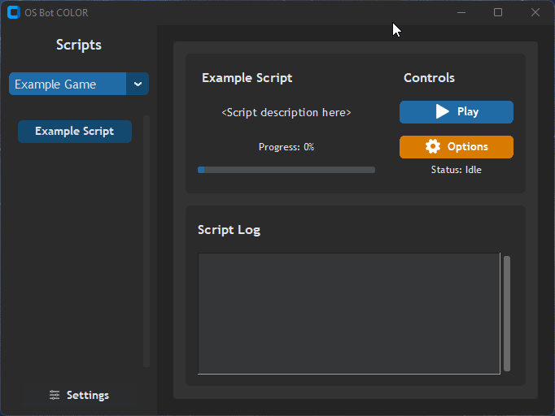

### ⚠️ This project is in Alpha stage ⚠️

# 
OS Bot COLOR (OSBC) is a desktop client for controlling and monitoring automation scripts for games. This application is paired with a toolkit for writing new scripts. Unlike popular automation frameworks that modify/inject code into a game's client, OSBC is completely hands-off; it uses a combination of color detection, image recognition, and optical character recognition to navigate the game. The goal of OSBC is to provide a fun and educational learning experience for new & seasoned developers alike, emphasizing the exploration of automation technologies and not to encourage or support activities that are in violation of any game's Terms of Service.

<!--
💬 [Join the Discord](https://discord.gg/S6DXZfma5z) to discuss the project, ask questions, and follow development

📹 Subscribe to [Kell's Code](https://www.youtube.com/@KellsCode/featured) on YouTube for updates and tutorials

⭐ If you like this project, please leave a Star :)
 -->

# Developer Setup 
1. Install [Python 3.10](https://www.python.org/downloads/release/python-3109/) *(not compatible with other major versions)*
2. Clone/download this repository
3. Open the project folder in your IDE of choice (Visual Studio Code recommended)
4. Open the repository folder in a terminal window
   1. Create a virtual environment ```py -3.10 -m venv env```
   2. Activate the newly created virtual environment ```.\env\Scripts\activate```
   3. Install the depedencies ```pip install -r requirements.txt```
5. Run `./src/OSBC.py` *(may need to restart IDE for it to recognize installed dependencies)*
6. If asked what program to run the script with, navigate to where python was installed in step 1
7. If getting errors for modules not existing e.g. `ImportError: No module named customtkinter` install the module `pip install customtkinter` and verify `pip show customtkinter` then run `python src/OSBC.py` again. Repeat this for each module that does not exist.

# Profile Setup
On the side panel choose configuration, navigate to the profile section, and select Import Profile.


Navigate to the RUNELITE PROFILE folder in this repo and select `NovaColors.properties`

## Tagging Objects
You must first have the NovaColors profile selected

### To tag an object
Shift + Right Click an object and select `Mark Object {ObjectName}`


### To change the tag color
Shift + Right click the object again and choose `Mark border color {ObjectName}` -> select a color


### To remove a tag
Shift + Right click the object and choose `Unmark Object {ObjectName}`

# Scripts
## Fisher
This bot fishes. Position your character near some fishing spots, tag them, and press Play.

Options:
Deposit in bank - Requires bank to be tagged yellow

Cook and drop: Requires cooking place to be marked yellow

Drop: Drops the fish

## Miner
This bot mines ores. Position your character near mining rocks, tag them, and press Play.

Options:
Deposit in bank - Requires bank to be tagged yellow

Drop: Drops the ores

## Runner
This bot runs between two points. Tag the start and end points, and press Play.

Options:
Loop count - Set the number of times to run the route

Pause between runs - Adds a delay between each run

## Smelter
This bot smelts ores into bars. Position your character near a furnace, tag it, and press Play.

Options:
Deposit in bank - Requires bank to be tagged yellow

Drop: Drops the bars

## Woodcutter
This bot chops trees. Position your character near trees, tag them, and press Play.

Options:
Deposit in bank - Requires bank to be tagged yellow

Drop: Drops the logs

# Documentation

See the [Wiki](https://github.com/kelltom/OSRS-Bot-COLOR/wiki) for tutorials, and software design information.

# Features
## User Interface
OSBC offers a clean interface for configuring, running, and monitoring your Python bots. For developers, this means that all you need to do is write a bot's logic loop, and *the UI is already built for you*.



### Script Log
The Script Log provides a clean and simple way to track your bot's progress. No more command line clutter!

```python
self.log_msg("The bot has started.")
```

### Simple Option Menus
OSBC allows developers to create option menus and parse user selections with ease.

```python
def create_options(self):
  ''' Declare what should appear when the user opens the Options menu '''
  self.options_builder.add_slider_option("running_time", "How long to run (minutes)?", 1, 180)
  self.options_builder.add_text_edit_option("text_edit_example", "Text Edit Example", "Placeholder text here")
  self.options_builder.add_checkbox_option("multi_select_example", "Multi-select Example", ["A", "B", "C"])
  self.options_builder.add_dropdown_option("menu_example", "Menu Example", ["A", "B", "C"])
```

## Human-like Mouse Movement
OSBC uses Bezier curves to create smooth, human-like mouse movements.

## Object Detection
Using color isolation, OSBC can quickly locate objects/NPCs outlined by solid colors and extract their properties into simple data structures.

## Random Click Distribution
With the help of the OSBC community, we've created a randomization algorithm that distributes clicks in a way that is more human-like.

## Efficient Image Searching
Sometimes, your bot might need to find a specific image on screen. We've modified OpenCV's template matching algorithm to be more efficient and reliable with UI elements and sprites - even supporting images with transparency.

## Lightning Fast Optical Character Recognition
We've ditched machine learned OCR in favor of a much faster and more reliable custom implementation. OSBC can locate text on screen in as little as **2 milliseconds**. That's **0.002 seconds**.

---

<p>
  <a href="https://www.buymeacoffee.com/kelltom" target="_blank">
    
  </a>
</p>
